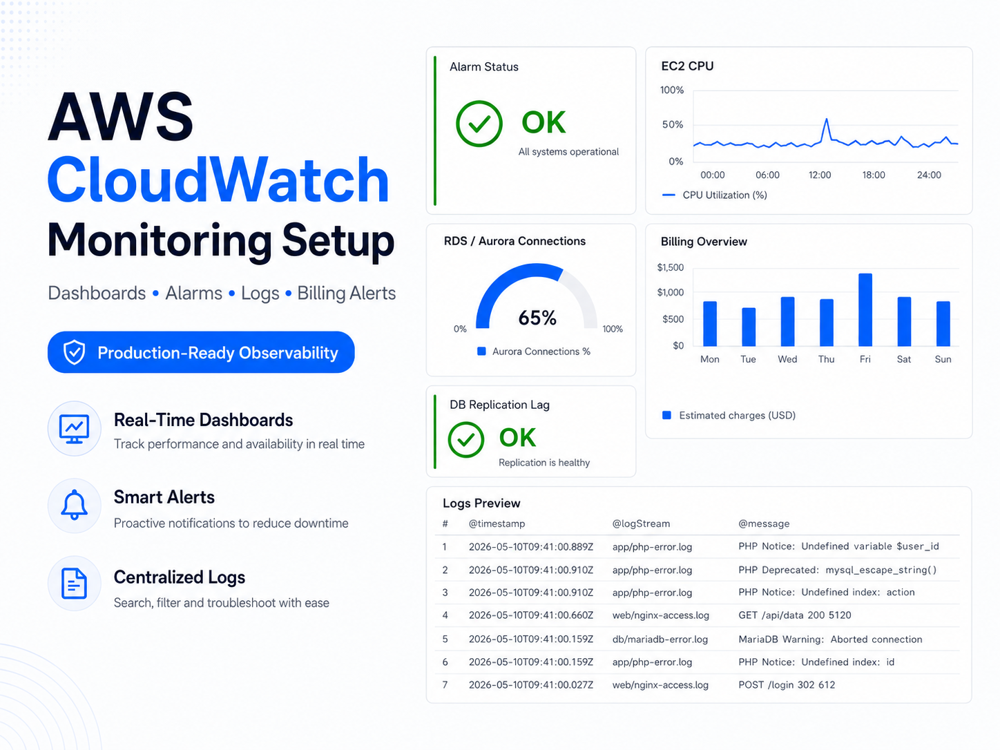
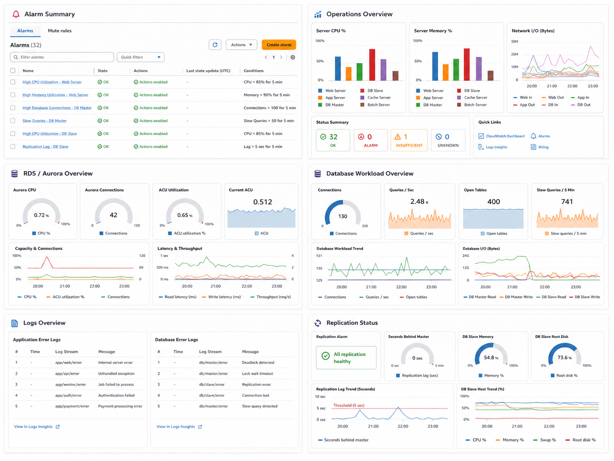
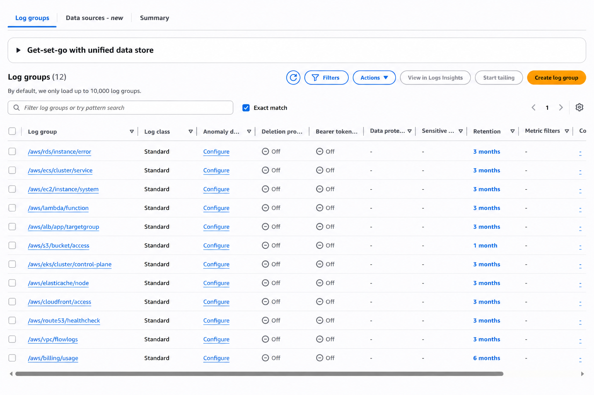

# AWS CloudWatch Monitoring Service

## Summary

This service creates a clear AWS CloudWatch monitoring baseline for production accounts. It focuses on dashboards, alarms, notifications, billing visibility, log retention, validation, and handover documentation.

It is designed for buyers who want practical AWS monitoring without ongoing support or a large DevOps contract.

## Common Problems

- You have AWS resources but no useful health dashboard.
- Important alarms are missing, noisy, duplicated, or unclear.
- Nobody is sure where alerts are sent.
- Billing alerts are missing or configured in the wrong region.
- CloudWatch log groups may keep data forever.
- EC2 memory and disk metrics are missing.
- The final monitoring setup is not documented clearly.

## What Is Delivered

- A CloudWatch dashboard for approved resources
- CloudWatch alarms for key infrastructure risks
- SNS email notification routing
- Billing alarm where supported
- CloudWatch Logs retention review
- Optional CloudWatch Agent setup for EC2 memory and disk metrics
- Validation notes
- Owner-friendly summary
- Technical handover report

## Project Screenshots

| Preview | What It Shows |
| --- | --- |
|  | Monitoring dashboard concept with alarms, database, logs, and replication sections |
|  | CloudWatch Logs retention and log group organisation |

## Example Coverage

| Area | Monitoring Signals |
| --- | --- |
| EC2 | CPU, status checks, memory, disk, swap, network |
| RDS / Aurora | CPU, connections, latency, storage or capacity signals |
| ALB | request count, 4xx/5xx, target 5xx, latency, unhealthy hosts |
| ECS / Lambda | CPU, memory, task health, errors, duration, throttles where applicable |
| Logs | retention review and selected error-log visibility |
| Billing | estimated charges alarm in the AWS billing metrics region |

## Workflow

| Step | Action |
| --- | --- |
| 1 | Client action: Share temporary AWS access using the [Buyer AWS Access Guide](docs/client-access-guide.md). Also send the AWS region, alert email, and billing threshold if billing is included. |
|   | My action: Review the provided access details and confirm the required information is available. |
| 2 | My action: Check your AWS infrastructure, current CloudWatch setup, alarms, logs, and billing metric availability. |
|   | Client action: Answer any quick scope questions, such as which workloads are production or most important. |
| 3 | My action: Propose the dashboard sections, alarms, thresholds, notification setup, and log retention changes. |
|   | Client action: Review and approve the proposed changes. |
| 4 | My action: Prepare the final CloudWatch setup for the approved scope. |
|   | My action: Deploy the dashboard, alarms, SNS notifications, billing alarm where applicable, and approved log retention.|
| 5 | Client action: Confirm the SNS email subscription if AWS sends one.  |
|   | Client action: Review the final dashboard links, alarm summary, and handover report. |

## Access Model

Root access is not required. AdministratorAccess is not required.

The preferred approach is a temporary IAM user, IAM role, IAM Identity Center assignment, or federated access with limited permissions. Access should be removed after delivery.

Setup guide: [Buyer AWS Access Guide](docs/client-access-guide.md)

## What This Is Not

This is not 24/7 support, incident response, production firefighting, application debugging, migration work, database tuning, guaranteed uptime, guaranteed cost reduction, or open-ended DevOps support.

## Example Materials

Screenshots and examples use demonstration values and placeholder infrastructure names.

## Start

Book the CloudWatch monitoring setup or message me on Upwork:

https://www.upwork.com/freelancers/tamerieid
