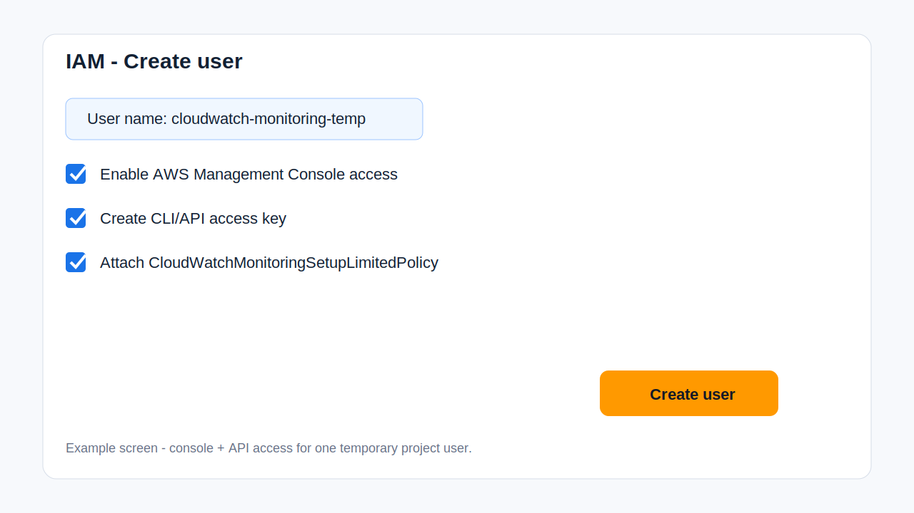
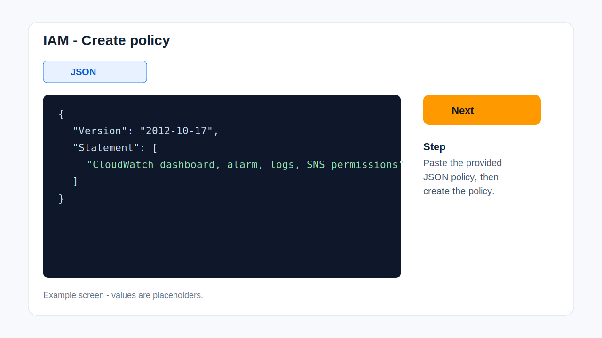
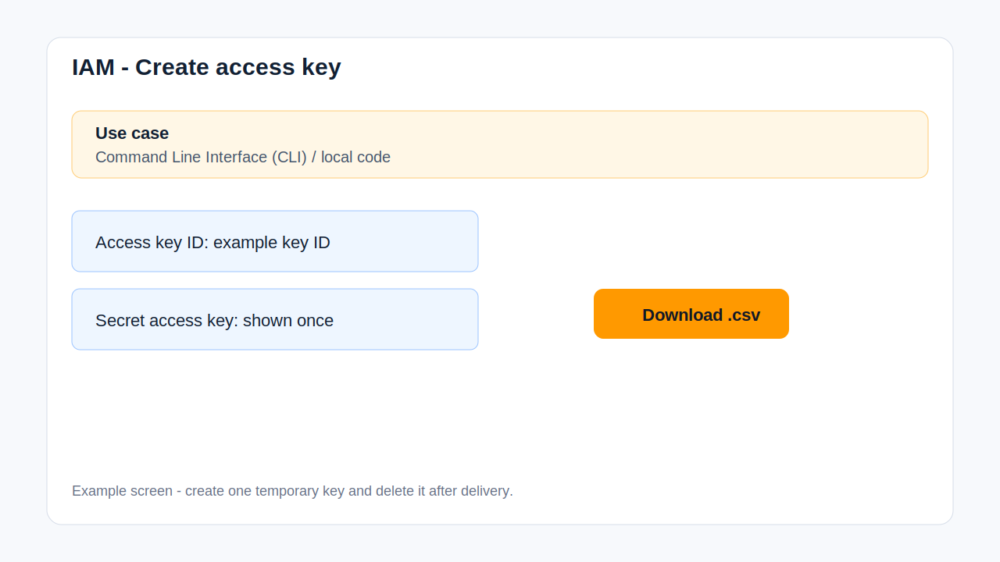

# Option 1 - Temporary IAM User With Console + API Access

## Summary

This is the easiest option for most buyers. It gives both access types needed for a smooth CloudWatch monitoring setup:

- **Console access** for visual review.
- **API access** for discovery, Terraform plan/apply after approval, validation, and reports.

## Step 1 - Open IAM

Open the AWS Console and go to:

```text
IAM -> Users -> Create user
```

## Step 2 - Create The User

Use this username:

```text
cloudwatch-monitoring-temp
```

Enable:

```text
Provide user access to the AWS Management Console
```

Use an autogenerated temporary password.



## Step 3 - Create The Policy

Go to:

```text
IAM -> Policies -> Create policy -> JSON
```

Open this file:

```text
public/iam-policy.json
```

Copy the JSON into the AWS policy JSON editor.

Policy name:

```text
CloudWatchMonitoringSetupLimitedPolicy
```



## Step 4 - Attach The Policy

Attach this policy to the temporary user:

```text
CloudWatchMonitoringSetupLimitedPolicy
```

## Step 5 - Create API Access Key

Open the new IAM user, then go to:

```text
Security credentials -> Access keys -> Create access key
```

Choose:

```text
Command Line Interface (CLI)
```

Download or copy the access key and secret key.



## Step 6 - Send These Details

```text
AWS sign-in URL or account alias:
IAM username: cloudwatch-monitoring-temp
Temporary password:
AWS_ACCESS_KEY_ID:
AWS_SECRET_ACCESS_KEY:
AWS_REGION:
Billing region: us-east-1
Notification email:
Billing threshold:
Approved resources or services:
MFA steps, if enabled:
```

## Step 7 - Remove Access After Delivery

After delivery:

```text
IAM -> Users -> cloudwatch-monitoring-temp
```

Then:

- Delete the access key.
- Delete the temporary user.
