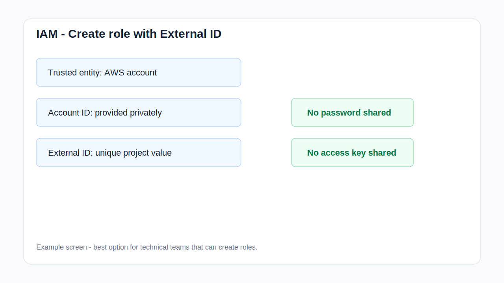

# Option 2 - Temporary IAM Role With External ID

## Summary

This is usually the best option for technical teams. You create a role in your AWS account and allow my AWS account to assume it using an External ID.

No password is shared. No access key is shared.

This still provides CLI/API access. I use the role ARN and External ID to assume the role and receive temporary AWS session credentials.

## Step 1 - Ask Me For Two Values

I will send:

```text
My AWS Account ID:
External ID:
```

## Step 2 - Create Role

Open:

```text
IAM -> Roles -> Create role
```

Trusted entity:

```text
AWS account
```

Enter the AWS Account ID I provide.

Enable:

```text
Require external ID
```

Enter the External ID I provide.



## Step 3 - Create The Policy

Go to:

```text
IAM -> Policies -> Create policy -> JSON
```

Open:

```text
public/iam-policy.json
```

Copy the JSON into the policy editor.

Policy name:

```text
CloudWatchMonitoringSetupLimitedPolicy
```

## Step 4 - Attach The Policy To The Role

Attach:

```text
CloudWatchMonitoringSetupLimitedPolicy
```

to the new role.

Role name:

```text
CloudWatchMonitoringSetupRole
```

## Step 5 - Send These Details

```text
Role ARN:
External ID:
AWS_REGION:
Billing region: us-east-1
Notification email:
Billing threshold:
Approved resources or services:
```

## Step 6 - Remove Access After Delivery

After delivery:

- Delete the role, or
- Remove the trust relationship.
