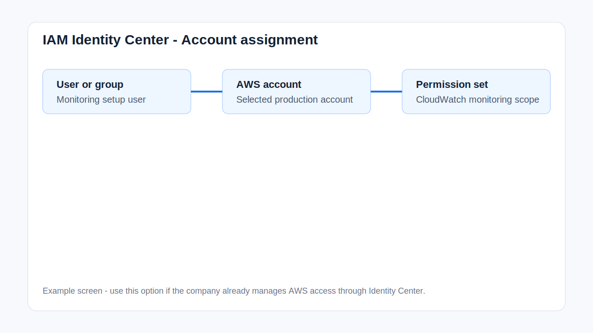

# Option 3 - IAM Identity Center Access

## Summary

Use this option if your company already uses AWS IAM Identity Center, AWS SSO, Okta, Azure AD, Google Workspace, or another federated login flow.

This option can provide both AWS Console access and CLI/API access through temporary sessions.

No long-term IAM access key is needed. I use the assigned Identity Center access to get temporary AWS session credentials.

## Step 1 - Create Permission Set

Open:

```text
IAM Identity Center -> Permission sets -> Create permission set
```

Create a custom permission set using the policy in:

```text
public/iam-policy.json
```

Suggested name:

```text
CloudWatchMonitoringSetup
```

## Step 2 - Assign User Or Group

Open:

```text
IAM Identity Center -> AWS accounts
```

Choose the target AWS account.

Assign the user or group to the account using the permission set.



## Step 3 - Send These Details

```text
IAM Identity Center start URL:
Assigned user email or username:
AWS account name or ID:
Permission set name:
AWS_REGION:
Billing region: us-east-1
Notification email:
Billing threshold:
Approved resources or services:
MFA steps, if enabled:
```

## Step 4 - CLI/API Access

For CLI/API access, share the login/start URL and assigned account/permission set. I will use the temporary session credentials provided through the SSO flow.

## Step 5 - Remove Access After Delivery

After delivery:

- Remove the user/group assignment from the AWS account, or
- Remove the permission set assignment.
